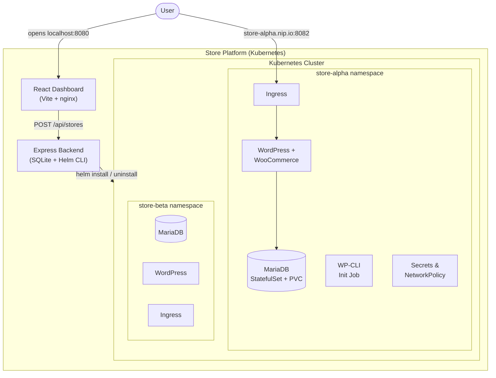
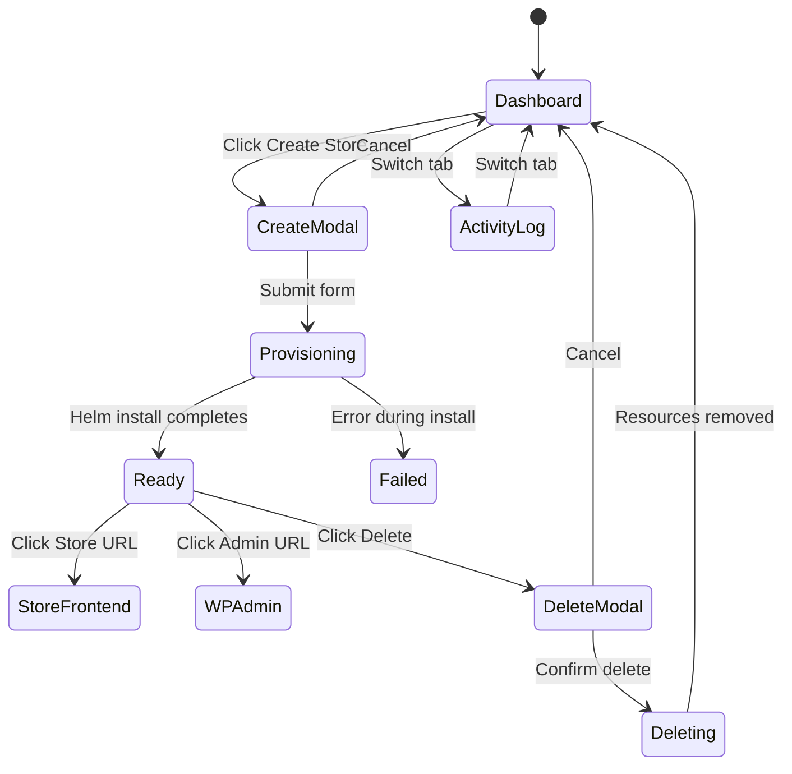

<div align="center">

# Kubernetes Store Orchestration Platform

**Built by Shabanya** | [GitHub](https://github.com/ishabanya)

[](https://kubernetes.io)
[](https://helm.sh)
[](https://react.dev)
[](https://woocommerce.com)
[](https://docker.com)

> **Self-service platform for deploying fully isolated WooCommerce stores on Kubernetes.**
>
> Each store runs in its own namespace with dedicated MariaDB, WordPress + WooCommerce, ingress routing, network policies, and resource quotas — provisioned in minutes through a single-click dashboard.

---

### Deploy a production-grade e-commerce store in 3 clicks.

[Getting Started](#getting-started) | [UI Walkthrough](#ui-walkthrough) | [Architecture](#architecture) | [API Reference](#api-reference)

</div>

---

## Highlights

| | Feature | Description |
|---|---------|-------------|
| **1-Click Deploy** | One-click store provisioning | Name your store, click create, and a full WooCommerce instance spins up with its own database, secrets, and ingress |
| **Live Status** | Real-time status tracking | Dashboard auto-polls every 5s during provisioning with animated spinners and color-coded status badges |
| **Isolated** | Full namespace isolation | Every store gets its own Kubernetes namespace, MariaDB, secrets, network policies, and resource quotas |
| **Observable** | Activity log & metrics | Built-in audit trail tab and `/api/metrics` endpoint for full observability |
| **Secure** | Rate limiting & abuse prevention | Request throttling, store count quotas, and RBAC-scoped service accounts |
| **Portable** | Same charts everywhere | Helm-driven architecture — identical templates for local dev and production, only values change |

---

## UI Walkthrough

### The Dashboard

The platform ships with a polished **React SPA** (Vite + nginx) that serves as your single control plane. The interface follows a clean, minimal design language:

- **Dark header bar** (`#1a1a2e`) with the platform title and a prominent **"+ Create Store"** CTA button in blue (`#4361ee`)
- **Tab navigation** — switch between **Stores** (grid view) and **Activity Log** (audit trail) with an underline-animated tab bar
- **Responsive card grid** — stores are displayed in a `CSS Grid` layout (`minmax(340px, 1fr)`) that auto-fills columns based on viewport width
- **Empty state** — when no stores exist, a centered message guides users: *"Click Create Store to deploy your first WooCommerce store"*

---

### Store Cards

Each store is represented as a **card component** with clear visual hierarchy:

```
+-----------------------------------------------+
|  My Awesome Shop              [ READY ]        |  <-- name + status badge
|  WooCommerce                                   |  <-- platform type (subtle gray)
|                                                |
|  Store: http://my-awesome-shop.127...nip.io    |  <-- clickable links (blue)
|  Admin: http://my-awesome-shop.127...nip.io/wp |
|                                                |
|  Feb 8, 2026, 2:30 PM            [ Delete ]   |  <-- timestamp + danger action
+-----------------------------------------------+
```

**Status badges** are color-coded pill elements with semantic meaning:

| Badge | Color | Meaning |
|-------|-------|---------|
| `READY` | Green (`#dcfce7` / `#166534`) | Store is live and accepting traffic |
| `PROVISIONING` | Amber (`#fef3c7` / `#92400e`) | Helm install in progress — includes animated CSS spinner |
| `DELETING` | Amber (`#fef3c7` / `#92400e`) | Helm uninstall in progress — includes animated CSS spinner |
| `FAILED` | Red (`#fef2f2` / `#dc2626`) | Provisioning error — error message shown inline on card |

Cards feature a **hover elevation effect** (`box-shadow` transitions from `0 1px 3px` to `0 4px 12px`) for clear interactive affordance.

---

### Create Store Dialog

Clicking **"+ Create Store"** opens a **centered modal** with a backdrop overlay (`rgba(0,0,0,0.5)`) that closes on outside click:

```
+------------------------------------------+
|  Create New Store                        |
|                                          |
|  Store Name                              |
|  [ My Awesome Store            ]         |
|  Any name you like — a URL-safe slug     |
|  is auto-generated                       |
|                                          |
|  Platform                                |
|  [ WooCommerce               v ]         |
|                                          |
|  Admin Username                          |
|  [ admin                       ]         |
|                                          |
|  Admin Password                          |
|  [ ******************************** ]    |
|  Min 6 characters. Leave empty to        |
|  auto-generate.                          |
|                                          |
|              [ Cancel ]  [ Create Store ] |
+------------------------------------------+
```

**Form UX details:**
- **Auto-focus** on the store name field for immediate typing
- **Inline validation** — name must be 2+ chars, username 3+ chars, password 6+ chars
- **Error messages** appear in red below the form before submission is allowed
- **Loading state** — the submit button shows "Creating..." and all fields are disabled during the API call
- **Platform selector** — WooCommerce is the active option; MedusaJS is shown as "Coming Soon" (disabled)
- **Focus ring** — inputs show a blue glow (`box-shadow: 0 0 0 3px rgba(67,97,238,0.1)`) on focus for accessibility

---

### Delete Confirmation

Clicking **Delete** on a store card opens a **confirmation modal** to prevent accidental data loss:

```
+------------------------------------------+
|  Delete Store                            |
|                                          |
|  Are you sure you want to delete         |
|  My Awesome Shop? This will remove all   |
|  data, including the database and        |
|  uploaded files. This action cannot be   |
|  undone.                                 |
|                                          |
|              [ Cancel ]  [ Delete Store ] |
+------------------------------------------+
```

- **Destructive action** button is red (`#ef4444`) to signal danger
- Button shows "Deleting..." during the async operation
- Both buttons are disabled while deletion is in progress

---

### Activity Log

Switching to the **Activity Log** tab shows a chronological audit trail:

```
+----------------------------------------------+
|  Activity Log                                |
|                                              |
|  store.created (my-awesome-shop)    2:30 PM  |
|  store.ready (my-awesome-shop)      2:34 PM  |
|  store.deleted (old-store)          1:15 PM  |
+----------------------------------------------+
```

- **Action names** in bold, **timestamps** in muted gray (`#94a3b8`)
- Entries separated by subtle dividers (`1px solid #f1f5f9`)
- Fetches the 20 most recent audit entries on tab switch

---

### Design System

The dashboard uses a consistent design system throughout:

| Token | Value | Usage |
|-------|-------|-------|
| **Primary** | `#4361ee` | Buttons, links, active tab, focus rings |
| **Danger** | `#ef4444` | Delete buttons, error text |
| **Surface** | `#ffffff` | Cards, modals, activity log |
| **Background** | `#f0f2f5` | Page background |
| **Header** | `#1a1a2e` | Top bar background |
| **Text Primary** | `#1a1a2e` | Headings, body text |
| **Text Muted** | `#94a3b8` | Timestamps, hints |
| **Border Radius** | `12px` / `8px` | Cards & modals / Buttons & inputs |
| **Font Stack** | `-apple-system, BlinkMacSystemFont, 'Segoe UI', Roboto` | System font for native feel |
| **Transition** | `all 0.2s` | Buttons, cards, inputs — consistent motion |

---

## Architecture



**Key components:**

| Component | Description |
|-----------|-------------|
| **Dashboard** | React SPA (Vite) served via nginx, reverse-proxies API calls to backend |
| **Backend** | Express.js REST API with SQLite, orchestrates Kubernetes via Helm CLI |
| **WooCommerce Chart** | Per-store Helm chart — MariaDB, WordPress, WP-CLI init, ingress, security |
| **Platform Chart** | Helm chart for dashboard, backend, RBAC, and HPA |

---

## Getting Started

### 1. Clone the Repository

```bash
git clone https://github.com/ishabanya/kubernetes_store_r1.git
cd kubernetes_store_r1
```

### 2. Install Prerequisites

<details>
<summary><strong>macOS</strong></summary>

```bash
# Homebrew (if not installed)
/bin/bash -c "$(curl -fsSL https://raw.githubusercontent.com/Homebrew/install/HEAD/install.sh)"

# Docker Desktop
brew install --cask docker
# Or use Colima (lightweight alternative):
# brew install docker colima && colima start --cpu 2 --memory 4 --disk 8

# Kubernetes tools
brew install minikube kubectl helm
```
</details>

<details>
<summary><strong>Windows</strong></summary>

```powershell
# Chocolatey (run PowerShell as Administrator)
Set-ExecutionPolicy Bypass -Scope Process -Force
[System.Net.ServicePointManager]::SecurityProtocol = [System.Net.ServicePointManager]::SecurityProtocol -bor 3072
iex ((New-Object System.Net.WebClient).DownloadString('https://community.chocolatey.org/install.ps1'))

# Docker Desktop (requires WSL2)
wsl --install
choco install docker-desktop -y

# Kubernetes tools
choco install minikube kubernetes-cli kubernetes-helm -y
```

> **Notes:** Enable "WSL 2 based engine" in Docker Desktop settings. Use **PowerShell** or **Git Bash** for all commands. Replace `eval $(minikube docker-env)` with `& minikube docker-env --shell powershell | Invoke-Expression`.
</details>

<details>
<summary><strong>Linux (Ubuntu / Debian)</strong></summary>

```bash
# Docker
sudo apt-get update && sudo apt-get install -y docker.io
sudo usermod -aG docker $USER && newgrp docker

# Minikube
curl -LO https://storage.googleapis.com/minikube/releases/latest/minikube-linux-amd64
sudo install minikube-linux-amd64 /usr/local/bin/minikube

# kubectl
curl -LO "https://dl.k8s.io/release/$(curl -L -s https://dl.k8s.io/release/stable.txt)/bin/linux/amd64/kubectl"
sudo install kubectl /usr/local/bin/kubectl

# Helm
curl https://raw.githubusercontent.com/helm/helm/main/scripts/get-helm-3 | bash
```
</details>

### 3. Deploy Locally (macOS / Linux)

```bash
# Start Minikube
minikube start --cpus=2 --memory=3072 --driver=docker
minikube addons enable ingress

# Build images inside Minikube's Docker daemon
eval $(minikube docker-env)
docker build -t store-platform-backend:latest -f Dockerfile.backend .
docker build -t store-platform-dashboard:latest ./dashboard/

# Deploy the platform
helm upgrade --install store-platform ./helm/store-platform/ \
  -f ./helm/store-platform/values-local.yaml --wait

# Port-forward (dashboard + store ingress)
kubectl port-forward -n store-platform svc/dashboard 8080:80 &
kubectl port-forward -n ingress-nginx svc/ingress-nginx-controller 8082:80 &
```

Or use the automated setup script:
```bash
chmod +x scripts/setup-local.sh && ./scripts/setup-local.sh
```

<details>
<summary><strong>Windows (PowerShell)</strong></summary>

```powershell
minikube start --cpus=2 --memory=3072 --driver=docker
minikube addons enable ingress

& minikube docker-env --shell powershell | Invoke-Expression
docker build -t store-platform-backend:latest -f Dockerfile.backend .
docker build -t store-platform-dashboard:latest ./dashboard/

helm upgrade --install store-platform ./helm/store-platform/ `
  -f ./helm/store-platform/values-local.yaml --wait

# Run each in a separate terminal:
kubectl port-forward -n store-platform svc/dashboard 8080:80
kubectl port-forward -n ingress-nginx svc/ingress-nginx-controller 8082:80
```
</details>

### 4. Open the Dashboard

```
http://localhost:8080
```

You should see the Store Platform header bar and an empty-state prompt inviting you to create your first store.

---

## Usage: End-to-End Walkthrough

### Step 1 — Create a Store

1. Open `http://localhost:8080` — you'll land on the **Stores** tab with the card grid
2. Click the blue **"+ Create Store"** button in the header bar
3. The **Create New Store** modal slides in with a backdrop overlay
4. Fill in the form:
   - **Store Name** — enter any name (e.g., `My Awesome Shop`). A URL-safe slug is auto-generated
   - **Platform** — WooCommerce is pre-selected
   - **Admin Username** — defaults to `admin`
   - **Admin Password** — leave blank to auto-generate, or set your own (6+ chars)
5. Click **"Create Store"** — the button changes to "Creating..." and fields lock

### Step 2 — Watch Provisioning in Real-Time

- A new card appears in the grid with an **amber PROVISIONING badge** and a rotating **CSS spinner**
- The dashboard **auto-polls every 5 seconds** while any store is provisioning
- Behind the scenes: Helm installs MariaDB, WordPress, WP-CLI init job, ingress, secrets, network policies, and resource quotas
- After 3-5 minutes the badge flips to **green READY** — store and admin URLs appear on the card

### Step 3 — Browse the Store & Place an Order

1. Click the **Store URL** on the card (e.g., `http://my-awesome-shop.127-0-0-1.nip.io:8082`)
2. You'll see a fully initialized WooCommerce storefront with sample products
3. Add a product to cart and click **Proceed to Checkout**
4. Fill in any billing details, select **Cash on Delivery**, and click **Place Order**
5. Verify in WP Admin: click the **Admin URL** on the card, then navigate to **WooCommerce > Orders**

### Step 4 — Delete a Store

1. Click the red **"Delete"** button on the store card
2. A **confirmation modal** warns that all data will be permanently removed
3. Click **"Delete Store"** — the badge changes to **amber DELETING** with a spinner
4. Once complete, the card disappears from the grid
5. Switch to the **Activity Log** tab to see the `store.deleted` audit entry

### Accessing Stores

| URL | Purpose |
|-----|---------|
| `http://localhost:8080` | Dashboard |
| `http://<store>.127-0-0-1.nip.io:8082` | Store frontend |
| `http://<store>.127-0-0-1.nip.io:8082/wp-admin` | WP Admin panel |

> Both port-forwards (8080 for dashboard, 8082 for stores) must be running. [nip.io](https://nip.io) provides zero-config wildcard DNS — no `/etc/hosts` editing needed.

---

## User Flows



---

## Production Deployment (k3s VPS)

<details>
<summary><strong>Click to expand production setup</strong></summary>

### 1. Install k3s
```bash
curl -sfL https://get.k3s.io | sh -
kubectl get nodes
```

### 2. Configure DNS
| Record | Value |
|--------|-------|
| `*.stores.yourdomain.com` | VPS IP (wildcard A) |
| `dashboard.stores.yourdomain.com` | VPS IP |
| `api.stores.yourdomain.com` | VPS IP |

### 3. Push Images
```bash
docker build -t ghcr.io/youruser/store-platform-backend:v1.0.0 -f Dockerfile.backend .
docker build -t ghcr.io/youruser/store-platform-dashboard:v1.0.0 ./dashboard/
docker push ghcr.io/youruser/store-platform-backend:v1.0.0
docker push ghcr.io/youruser/store-platform-dashboard:v1.0.0
```

### 4. (Optional) TLS with cert-manager
```bash
kubectl apply -f https://github.com/cert-manager/cert-manager/releases/latest/download/cert-manager.yaml
```

### 5. Deploy
```bash
helm upgrade --install store-platform ./helm/store-platform/ \
  -f ./helm/store-platform/values-prod.yaml \
  --set backend.image=ghcr.io/youruser/store-platform-backend:v1.0.0 \
  --set dashboard.image=ghcr.io/youruser/store-platform-dashboard:v1.0.0 \
  --wait
```

### Local vs Production

| Concern | Local (Minikube) | Production (k3s) |
|---------|------------------|-------------------|
| Ingress class | nginx | traefik |
| Base domain | `127-0-0-1.nip.io` | `stores.yourdomain.com` |
| Image pull | `Never` (local) | `Always` (registry) |
| Replicas | 1 | 2 (HPA up to 5) |
| TLS | None | cert-manager + Let's Encrypt |
| Max stores | 10 | 50 |

Same Helm charts, same templates — **only values change**.
</details>

---

## API Reference

| Method | Endpoint | Description |
|--------|----------|-------------|
| `POST` | `/api/stores` | Create a store (triggers async Helm install) |
| `GET` | `/api/stores` | List all stores with current status |
| `GET` | `/api/stores/:id` | Get single store details |
| `DELETE` | `/api/stores/:id` | Delete a store (triggers async Helm uninstall) |
| `GET` | `/api/stores/audit/log` | Audit trail of all actions |
| `GET` | `/api/metrics` | Platform metrics (store counts, resource usage) |
| `GET` | `/api/health` | Health check endpoint |

---

## Upgrade & Rollback

```bash
# View release history
helm history store-platform

# Upgrade with a new image
helm upgrade store-platform ./helm/store-platform/ \
  -f ./helm/store-platform/values-prod.yaml \
  --set backend.image=ghcr.io/youruser/store-platform-backend:v1.1.0

# Rollback to previous revision
helm rollback store-platform 1
```

---

## Project Structure

```
kubernetes_store_r1/
├── dashboard/                    # React (Vite) frontend
│   ├── src/
│   │   ├── components/
│   │   │   ├── StoreList.jsx     # Grid view with polling & empty state
│   │   │   ├── StoreCard.jsx     # Card with status badge, URLs, delete
│   │   │   ├── CreateStoreDialog.jsx   # Modal form with validation
│   │   │   ├── DeleteConfirmDialog.jsx # Destructive action confirmation
│   │   │   └── ActivityLog.jsx   # Audit trail table
│   │   ├── services/api.js       # Axios API client
│   │   ├── App.jsx               # Tab navigation (Stores / Activity Log)
│   │   └── index.css             # Full design system (colors, cards, modals)
│   ├── Dockerfile                # Multi-stage: Node build -> nginx serve
│   └── nginx.conf                # Reverse proxy /api/ to backend
├── backend/                      # Node.js + Express API
│   ├── src/
│   │   ├── controllers/          # REST route handlers
│   │   ├── services/             # Business logic + async provisioners
│   │   ├── kubernetes/           # Helm CLI wrapper
│   │   ├── middleware/           # Rate limiting, error handling
│   │   ├── database/            # SQLite (better-sqlite3)
│   │   └── utils/               # Logger, validation
│   └── package.json
├── Dockerfile.backend            # Backend image with Helm + kubectl
├── helm/
│   ├── store-platform/           # Platform chart (dashboard, backend, RBAC, HPA)
│   │   ├── templates/
│   │   ├── values.yaml
│   │   ├── values-local.yaml
│   │   └── values-prod.yaml
│   └── woocommerce-store/        # Per-store chart
│       ├── templates/            # MariaDB, WordPress, init job, ingress, etc.
│       ├── values.yaml
│       ├── values-local.yaml
│       └── values-prod.yaml
├── scripts/
│   ├── setup-local.sh            # Automated local setup
│   ├── teardown.sh               # Clean everything up
│   └── add-hosts.sh              # Fallback /etc/hosts setup
├── docs/
│   ├── system-design.md          # Architecture, tradeoffs, scaling, security
│   └── local-to-prod.md          # Local vs production differences
└── README.md
```

---

## Teardown

```bash
# Remove all stores and the platform
./scripts/teardown.sh

# Or manually:
helm uninstall store-platform -n store-platform
minikube stop && minikube delete
```

---

## Documentation

See **[docs/system-design.md](docs/system-design.md)** for in-depth coverage:

- Architecture decisions and tradeoffs
- Isolation model (namespaces, ResourceQuota, LimitRange, NetworkPolicy)
- Idempotency, failure handling, and cleanup guarantees
- Security posture (secrets, RBAC, container hardening)
- Horizontal scaling plan (HPA, concurrency queue)
- Abuse prevention (rate limiting, quotas, audit trail)
- Local-to-production story
- Upgrade / rollback approach

---

<div align="center">

**Shabanya** | [github.com/ishabanya](https://github.com/ishabanya)

</div>
